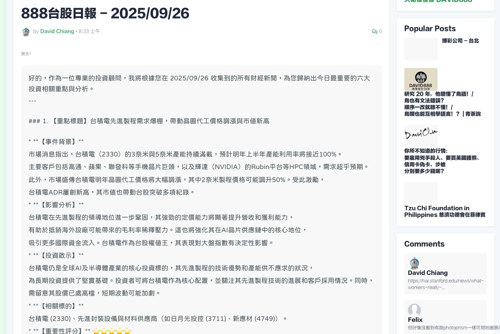

# DAVID Blog Theme

這是為 [david888.com](https://david888.com) 博客定制的 Blogger 主題模板。

## 特點

### 🎨 設計特色

- **雙模式支持**：支援淺色和深色模式，自動適應用戶偏好
- **Adobe Color 調色板**：採用精心設計的色彩方案，提供舒適的閱讀體驗
- **現代化界面**：清潔、簡約的設計風格，注重內容可讀性

### 🔤 字體與排版

- **Google Fonts 集成**：使用 Huninn 字體，提供優質的中英文字體渲染
- **優化排版**：調整段落間距，改善閱讀流暢度
- **響應式設計**：完美適配桌面、平板和手機設備

### 💻 開發者友好

- **代碼塊支持**：內建語法高亮和代碼格式化
- **自定義變數**：通過 Blogger 變數系統輕鬆調整顏色、字體等
- **SEO 優化**：結構化標記，提升搜索引擎可見度

## 安裝說明

1. 下載 `theme.xml` 文件
2. 登錄您的 Blogger 儀表板
3. 進入「主題」→「自定義」→「編輯 HTML」
4. 替換整個主題代碼
5. 保存並預覽

## 自定義選項

主題通過 Blogger 的變數系統提供豐富的自定義選項：

### 顏色設定

- 主色調：預設為綠色系，可調整為其他色彩
- 背景色：淺色模式使用柔和灰色，深色模式使用深灰
- 文字顏色：自動適應模式切換

### 字體設定

- 主要字體：Huninn
- 標題字體：Huninn
- 介面字體：系統字體

### 佈局調整

- 文章背景：添加柔和背景色和圓角
- 段落間距：優化為 1.2em
- 代碼塊樣式：深色背景，語法高亮

## 技術細節

- **平台**：Blogger (Google)
- **語言**：XML + CSS
- **字體**：Google Fonts (Huninn)
- **色彩理論**：Adobe Color 調色板
- **響應式**：Mobile-first 設計

## 貢獻

歡迎提交 Issue 和 Pull Request！

## 授權

本主題遵循 MIT 授權條款。

